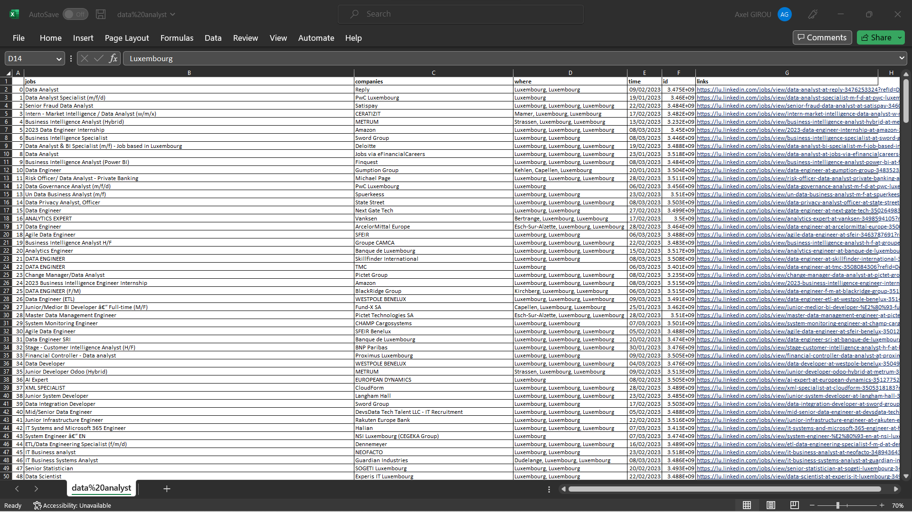

# ETL-Linkedin

In the first cell of Linkedin Scrapping, chose your own criterias:

```
#To update:
job_id = 'data analyst'             #job
job = job_id.replace(' ','%20')     
location = 'Luxembourg'             #location
number_of_pages = 10                #Number of pages to scrap
```

Then run the selenium code and you will receive a csv with all your job opportunities with their details and link.

Example of result: 

